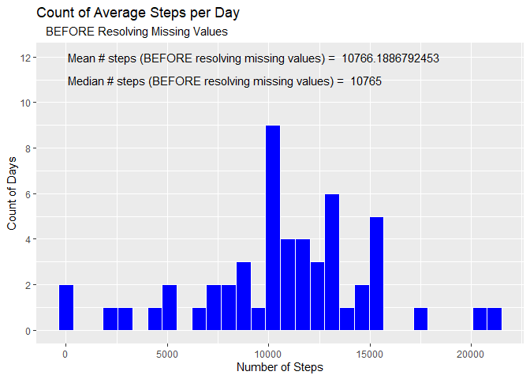
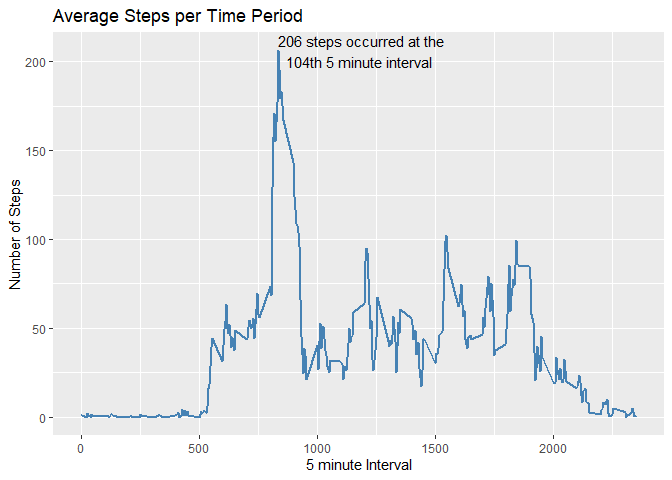
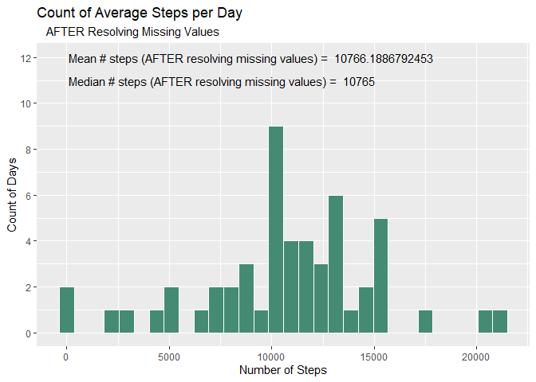
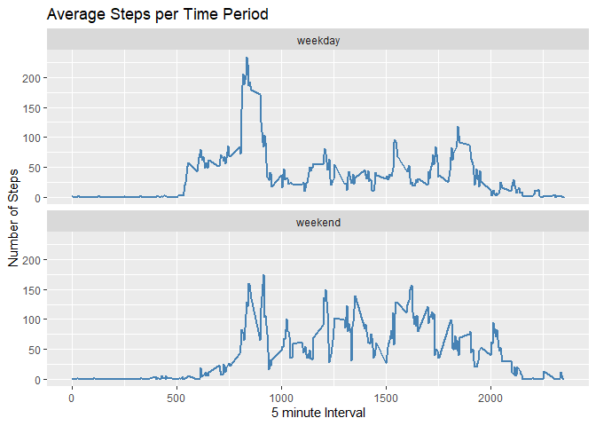

## Loading and preprocessing the data

### Approach

*  The 'dplyr', 'ggplot2' and 'scales' packages are used throughout the assessment. 

*  The 'activity' dataset (in a zip file) is downloaded and read into a working
dataframe ('rData')

*  The 'date' field is converted to date format 


```r
library(dplyr)
```

```
## 
## Attaching package: 'dplyr'
```

```
## The following objects are masked from 'package:stats':
## 
##     filter, lag
```

```
## The following objects are masked from 'package:base':
## 
##     intersect, setdiff, setequal, union
```

```r
library(ggplot2)
library(scales)

        temp <- tempfile()
        furl <- "https://d396qusza40orc.cloudfront.net/repdata%2Fdata%2Factivity.zip"
        download.file(furl, temp)
        rData <- read.table(unz(temp, "activity.csv"),sep=",", header=TRUE)
        unlink(temp)
        rData$date <- as.Date(rData$date) 
```


## What is mean total number of steps taken per day?

### Approach

*  Using ** complete cases only **, 5-min interval data for each day is summarized to the day level

*  The mean and median of the steps per day are calculated  

*  A histogram by day is generated


```r
##
## What is mean total number of steps taken per day?
##         
        sumSteps <- rData[complete.cases(rData),] %>% 
                                group_by(date) %>% 
                                        summarize(totSteps = sum(steps))
```

```
## `summarise()` ungrouping output (override with `.groups` argument)
```

```r
        mean_steps <- mean(sumSteps$totSteps)
        median_steps <- median(sumSteps$totSteps)
        mean_text <- paste("Mean # steps (BEFORE resolving missing values) = ", mean_steps)
        median_text <- paste("Median # steps (BEFORE resolving missing values) = ", median_steps)
        
      
        ggplot(data=sumSteps, aes(x=totSteps)) + 
                geom_histogram(color = "white", fill = "blue", bins=30) +
                scale_y_continuous(breaks=pretty_breaks()) +
                annotate(geom="text", x=100, y=12,
                         label=mean_text, hjust=0) +
                annotate(geom="text", x=100, y=11,
                         label=median_text, hjust=0) +
                labs(
                      title="Count of Average Steps per Day",
                      subtitle="   BEFORE Resolving Missing Values",
                      x = "Number of Steps",
                      y = "Count of Days"
                )
```

<!-- -->

```r
        mean_text
```

```
## [1] "Mean # steps (BEFORE resolving missing values) =  10766.1886792453"
```

```r
        median_text
```

```
## [1] "Median # steps (BEFORE resolving missing values) =  10765"
```


## What is the average daily activity pattern?

### Approach

*  Calculate the average number of steps taken during each 5 minute interval using ** complete case ** s only.

*  Create a time series plot with 5 minute interval on x-axis and average steps taken on the y-axis

*  Maximum number of steps at an interval are calculated.


```r
##
## What is the average daily activity pattern?
##

        
        intMean <- rData[complete.cases(rData),] %>% 
                         group_by (interval) %>% 
                                summarize(newSteps = mean(steps))
```

```
## `summarise()` ungrouping output (override with `.groups` argument)
```

```r
        y <- intMean$newSteps[which.max(intMean$newSteps)]
        x <- intMean$interval[which.max(intMean$newSteps)]
        intNum <- which.max(intMean$newSteps)
        intNum_text <- paste(intNum,"th", sep="")
        max_steps <- paste(format(round(y,0)), "steps occurred at the \n ", 
                           intNum_text, "5 minute interval")
        
        ggplot(data=intMean, aes(x=interval, y=newSteps)) +
                geom_line(color = "steelblue", size = 1) +
                annotate(geom="text", x=x, y=y,
                         label=max_steps, hjust=0) +
      
                labs (
                        title = "Average Steps per Time Period",
                        x = "5 minute Interval",
                        y = "Number of Steps"
                )
```

<!-- -->

```r
        max_steps <- gsub("the \n ", "the", max_steps)
        max_steps
```

```
## [1] "206 steps occurred at the 104th 5 minute interval"
```


## Imputing missing values

### Approach

*  Resolve missing data in 'steps' variable ("NA") using the following approach

    a.  Utilize the mean for each 5 minute interval (store in 'intMean')
    b.  Replace "NA" for an interval with appropriate mean (from step a) into the 'newSteps' variable
    
*  The mean steps per day histogram is re-generated using the cleaned data.

*  Mean and median values are re-calculated and compared to the previously captured numbers.


```r
##
## Imputing missing values
##

        rData_clean <- rData %>% 
                        mutate(newSteps = 
                                ifelse(is.na(steps), 
                                  intMean$newSteps[match(rData$interval,intMean$interval)], 
                                  steps))
        sumSteps_clean <- rData_clean[complete.cases(rData_clean),] %>% 
                group_by(date) %>% 
                summarize(totSteps = sum(newSteps))
```

```
## `summarise()` ungrouping output (override with `.groups` argument)
```

```r
        mean_steps_clean <- mean(sumSteps_clean$totSteps)
        median_steps_clean <- median(sumSteps_clean$totSteps)
        mean_text <- paste("Mean # steps (AFTER resolving missing values) = ", mean_steps_clean)
        median_text <- paste("Median # steps (AFTER resolving missing values) = ", median_steps_clean)

        
        ggplot(data=sumSteps_clean, aes(x=totSteps)) + 
                geom_histogram(color = "white", fill = "aquamarine4", bins=30) +
                scale_y_continuous(breaks=pretty_breaks()) +
                  annotate(geom="text", x=100, y=12,
                         label=mean_text, hjust=0) +
                annotate(geom="text", x=100, y=11,
                         label=median_text, hjust=0) +
                labs(
                        title="Count of Average Steps per Day",
                        subtitle="   AFTER Resolving Missing Values",
                        x = "Number of Steps",
                        y = "Count of Days"
                )
```

<!-- -->

```r
        mean_steps_clean <- mean(sumSteps_clean$totSteps)
        median_steps_clean <- median(sumSteps_clean$totSteps)
        mean_text
```

```
## [1] "Mean # steps (AFTER resolving missing values) =  10766.1886792453"
```

```r
        mean_steps_clean
```

```
## [1] 10766.19
```

```r
        median_text
```

```
## [1] "Median # steps (AFTER resolving missing values) =  10765"
```

```r
        median_steps_clean
```

```
## [1] 10765
```

### Conclusions:

*  Resolving missing values did ** not ** appear to change the number of mean and median values.   


## Are there differences in activity patterns between weekdays and weekends?

### Approach

*  Add a 'weekday_indicator' factor variable to the clean data to classify the date as "weekday" (M-F) or "weekend" (S,S)

*  Calculate the mean number of steps for each 5-minute interval, grouping by 'weekday_indicator'

*  The interval with the highest number of steps in each weekday/weekend category is calculated.

*  A 2-panel histogram is plotted 


```r
##
## Are there differences in activity patterns between weekdays and weekends

  
        rData_clean <- rData_clean %>% 
                mutate(weekday_indicator = 
                               ifelse(weekdays(rData_clean$date) %in% 
                                              c("Saturday", "Sunday"), "weekend","weekday"))      
        intMean <- rData_clean[complete.cases(rData_clean),] %>% 
                group_by (weekday_indicator, interval) %>% 
                summarize(newSteps = mean(newSteps))
```

```
## `summarise()` regrouping output by 'weekday_indicator' (override with `.groups` argument)
```

```r
        weekday_max <- which.max(filter(intMean,weekday_indicator == "weekday")$newSteps)
        weekend_max <- which.max(filter(intMean,weekday_indicator == "weekend")$newSteps)
        weekday_tag <- paste("Weekday max steps =", weekday_max)
        weekend_tag <- paste("Weekend max steps =", weekend_max)
        
        ggplot(data=intMean, aes(x=interval, y=newSteps)) +
                geom_line(color = "steelblue", size = 1) +
                labs (
                        title = "Average Steps per Time Period",
                        x = "5 minute Interval",
                        y = "Number of Steps"
                ) +
                facet_wrap(~ weekday_indicator, dir = "v") 
```

<!-- -->

```r
        paste("Maximum number of weekday steps = ", format(round(intMean$newSteps[weekday_max],0)))
```

```
## [1] "Maximum number of weekday steps =  234"
```

```r
        paste("Maximum number of weekend steps = ", format(round(intMean$newSteps[weekend_max],0)))
```

```
## [1] "Maximum number of weekend steps =  84"
```

